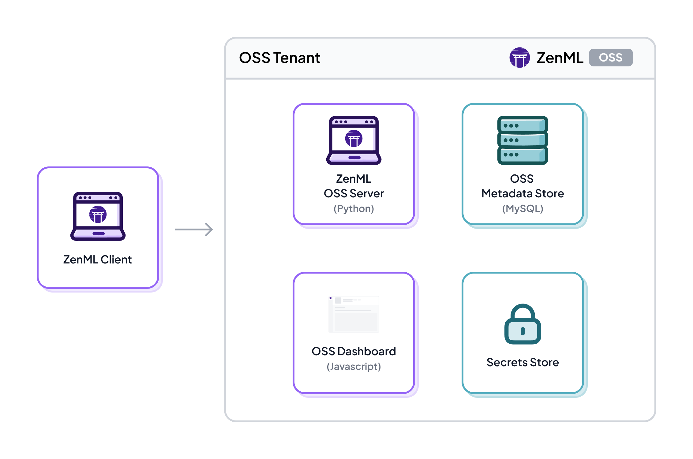

# 🤔 Deploying ZenML

Moving your ZenML Server to a production environment offers several benefits over staying local:

1. **Scalability**: Production environments are designed to handle large-scale workloads, allowing your models to process more data and deliver faster results.
2. **Reliability**: Production-grade infrastructure ensures high availability and fault tolerance, minimizing downtime and ensuring consistent performance.
3. **Collaboration**: A shared production environment enables seamless collaboration between team members, making it easier to iterate on models and share insights.

Despite these advantages, transitioning to production can be challenging due to the complexities involved in setting up the needed infrastructure.

## Components

A ZenML deployment consists of multiple infrastructure components:

- [FastAPI server](https://github.com/zenml-io/zenml/tree/main/src/zenml/zen_server) backed with a SQLite or MySQL database
- [Python Client](https://github.com/zenml-io/zenml/tree/main/src/zenml)
- An [open-source companion ReactJS](https://github.com/zenml-io/zenml-dashboard) dashboard
- (Optional) [ZenML Pro API + Database + ZenML Pro dashboard](../system-architectures.md)

You can read more in-depth about the system architecture of ZenML [here](../system-architectures.md).
This docs page will focus on the components required to deploy ZenML OSS.

Details on the ZenML Python Client

The ZenML client is a Python package that you can install on your machine. It
is used to interact with the ZenML server. You can install it using the `pip`
command as outlined [here](../installation.md).

This Python package gives you [the `zenml` command-line interface](https://sdkdocs.zenml.io/latest/cli/) which
you can use to interact with the ZenML server for common tasks like managing
stacks, setting up secrets, and so on. It also gives you the general framework that let's you
[author and deploy pipelines](../../user-guide/starter-guide/README.md) and so forth.

If you want to have more fine-grained control and access to the metadata that
ZenML manages, you can use the Python SDK to access the API. This allows you to
create your own custom automations and scripts and is the most common way teams
access the metadata stored in the ZenML server. The full documentation for the
Python SDK can be found [here](https://sdkdocs.zenml.io/latest/). The full HTTP
[API documentation](../../reference/api-reference.md) can also be found by adding the 
`/doc` suffix to the URL when accessing your deployed ZenML server.

### Deployment scenarios

When you first get started with ZenML, you have the following architecture on your machine.

The SQLite database that you can see in this diagram is used to store
information about pipelines, pipeline runs, stacks, and other configurations.
This default setup allows you to get started and try out the core features but
you won't be able to use cloud-based components like serverless orchestrators
and so on.

Users can run the `zenml up` command to spin up a local ZenML OSS server to serve the
dashboard. For the local OSS server option, the `zenml up` command implicitly
connects the client to the server. The diagram for this looks as follows:


Currently the ZenML server supports a legacy and a brand-new version of the dashboard. To use the legacy version simply use the
following command `zenml up --legacy`


In order to move into production, the ZenML server needs to be deployed somewhere centrally so that the different cloud stack components can read from and write to the server. Additionally, this also allows all your team members to connect to it and share stacks and pipelines.

You connect to your deployed ZenML server using the `zenml connect` command and
then you have the full benefits and power of ZenML. You can use all the
cloud-based components, your metadata will be stored and synchronized across all
the users of the server and you can leverage features like centralized logs
storage and pipeline artifact visualization.

## How to deploy ZenML

Deploying the ZenML Server is a crucial step towards transitioning to a production-grade environment for your machine learning projects. By setting up a deployed ZenML Server instance, you gain access to powerful features, allowing you to use stacks with remote components, centrally track progress, collaborate effectively, and achieve reproducible results.

Currently, there are two main options to access a deployed ZenML server:

1. **Managed deployment:** With [ZenML Pro](../zenml-pro/README.md) offering you can utilize a control plane to create ZenML servers, also known as [tenants](../zenml-pro/tenants.md). These tenants are managed and maintained by ZenML's dedicated team, alleviating the burden of server management from your end. Importantly, your data remains securely within your stack, and ZenML's role is primarily to handle tracking of metadata and server maintenance.
2. **Self-hosted Deployment:** Alternatively, you have the ability to deploy ZenML on your own self-hosted environment. This can be achieved through various methods, including using [Docker](./deploy-with-docker.md), [Helm](./deploy-with-helm.md), or [HuggingFace Spaces](./deploy-using-huggingface-spaces.md). We also offer our Pro version for self-hosted deployments, so you can use our full paid feature-set while staying fully in control with an airgapped solution on your infrastructure.

Both options offer distinct advantages, allowing you to choose the deployment approach that best aligns with your organization's needs and infrastructure preferences. Whichever path you select, ZenML facilitates a seamless and efficient way to take advantage of the ZenML Server and enhance your machine learning workflows for production-level success.

### Options for deploying ZenML

Documentation for the various deployment strategies can be found in the following pages below (in our 'how-to' guides):

<table data-card-size="large" data-view="cards"><thead><tr><th></th><th></th><th data-hidden></th><th data-hidden data-type="content-ref"></th><th data-hidden data-card-target data-type="content-ref"></th></tr></thead><tbody><tr><td><mark style="color:purple;"><strong>Deploying ZenML using ZenML Pro</strong></mark></td><td>Deploying ZenML using ZenML Pro.</td><td></td><td></td><td><a href="../zenml-pro/README.md">deploy-with-zenml-cli.md</a></td></tr><tr><td><mark style="color:purple;"><strong>Deploy with Docker</strong></mark></td><td>Deploying ZenML in a Docker container.</td><td></td><td></td><td><a href="./deploy-with-docker.md">deploy-with-docker.md</a></td></tr><tr><td><mark style="color:purple;"><strong>Deploy with Helm</strong></mark></td><td>Deploying ZenML in a Kubernetes cluster with Helm.</td><td></td><td></td><td><a href="./deploy-with-helm.md">deploy-with-helm.md</a></td></tr><tr><td><mark style="color:purple;"><strong>Deploy with HuggingFace Spaces</strong></mark></td><td>Deploying ZenML to Hugging Face Spaces.</td><td></td><td></td><td><a href="./deploy-using-huggingface-spaces.md">deploy-with-hugging-face-spaces.md</a></td></tr></tbody></table>

<figure><figcaption></figcaption></figure>
